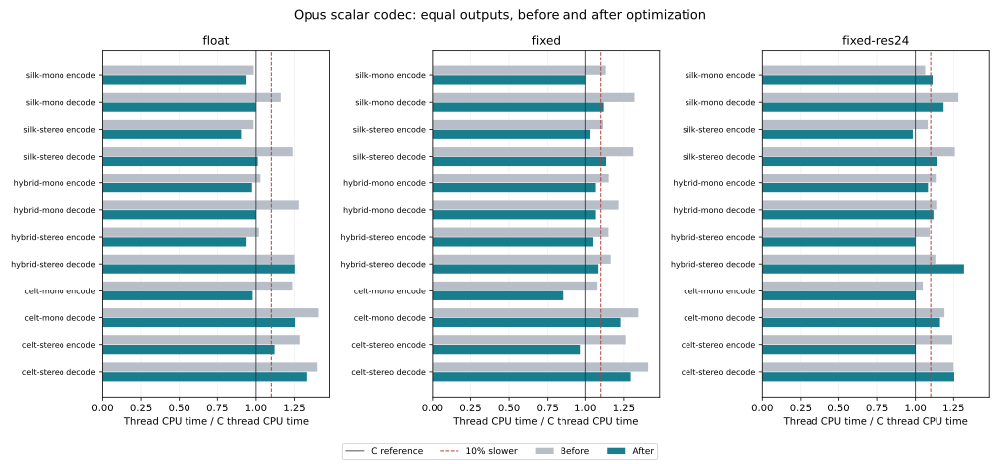

# Codec performance

After all 176 GitHub checks passed for `38f077cc`, the native codec was compared
with the pinned scalar C implementation. Cases taking at least 10% longer than
C guided profiling and optimization. Exact output compatibility, safe Rust, and
the WebAssembly core remain acceptance requirements.

## Measured result

The standard matrix has 36 measurements: SILK, hybrid, and CELT, mono and stereo,
encoding and decoding, for float, fixed, and 24-bit fixed arithmetic. Each ratio
below is a geometric mean of per-case Rust/C thread CPU time ratios. Smaller is
better; 1.00 means equal time to C.

| Arithmetic profile | Before Rust/C | After Rust/C | Relative cost reduction | Cases at least 10% slower, before / after |
| --- | ---: | ---: | ---: | ---: |
| Float | 1.181 | 1.050 | 11.1% | 8 / 4 |
| Fixed | 1.217 | 1.069 | 12.1% | 11 / 4 |
| 24-bit fixed | 1.156 | 1.108 | 4.2% | 8 / 7 |



The additional 32 measurements cover 8/16 kHz SILK, complexity zero, 2.5/10/60 ms
CELT, one lost packet in five, PFA transforms, and 48/96 kHz QEXT. The complete
[tables](../tests/fixtures/performance/2026-10-02/tables.md) include every remaining
case at or above 1.10, along with actual microseconds per frame.
The [raw records](../tests/fixtures/performance/2026-10-02/) retain all seven
samples, wall times, input/output hashes, toolchain versions, and executable
hashes. [Summary JSON](../tests/fixtures/performance/2026-10-02/summary.json)
contains the aggregates.

The 10% goal is not met for every case: 15 of the 36 standard measurements and
21 of the 32 additional measurements remain at or above 1.10. In particular,
short CELT frames, CELT decoding, PFA, and QEXT need further work. The largest
remaining measured ratio is 1.539 for 48 kHz stereo QEXT encoding. These figures
describe this host and corpus, rather than a guarantee on other machines.

That QEXT encoding record has substantial variability: its Rust samples range
from 322.7 to 849.3 microseconds per frame. A longer recheck with nine repetitions
targeting one second of C work per sample measured 1.369 before and 1.144 after
for encoding, and 1.402 before and 1.272 after for decoding. The longer run
confirms an improvement, with a remaining slowdown above 10%, and illustrates
the limits of short samples on this guest. Both
[before](../tests/fixtures/performance/2026-10-02/qext-stereo-recheck-before.json)
and [after](../tests/fixtures/performance/2026-10-02/qext-stereo-recheck-after.json)
records are retained separately from the uniform 68-case matrix.

## Changes

- Use the reference's static PVQ combinatorial tables for pulse encoding,
  removing repeated O(N*K) row construction and per-band allocation. Reuse
  table rows during pulse decoding.
- Keep normal PVQ search and pulse scratch on the stack, with a heap fallback
  for larger custom dimensions.
- Snapshot only active entropy storage during rate/distortion trials, rather
  than the entire caller-supplied packet buffer. The public full-buffer snapshot
  behavior remains available and has an independent restoration regression.
- Remove inverse-MDCT copies and temporary output buffers, use strided frequency
  input directly, and avoid unnecessary de-emphasis allocation at 48 kHz.
- Split FFT butterfly slices into disjoint arms, allowing the compiler to remove
  repeated bounds checks while preserving arithmetic order.
- Use bounded IEEE-754 rounding for 16-bit float PCM conversion. Exhaustive
  integer/half-integer neighborhoods and 100,000 arbitrary float bit patterns
  are checked against the independent general software rounding function.
- Enable ThinLTO and one code generation unit in the release profile.

These changes preserve all numerical reference conditions. They add neither
unsafe blocks nor C/FFI codec dependencies. A consuming Cargo workspace controls
its own release profile; enable equivalent LTO settings there to reproduce the
build optimization.

## Measurement method

Measurements were made on an x86-64 Linux KVM guest reporting an Intel Xeon
Platinum 8573C, with Rust 1.99.0 and GCC 14.2.0. Benchmark processes are pinned
to CPU 0 and run sequentially. Compilation and compatibility checks use other
CPUs. The guest has a four-CPU quota and five visible vCPUs. Host scheduling,
frequency changes, and shared caches still introduce variability.

The C library comes from immutable revision
`503d81b138d76621aae4b12786e90de48aa8db3a`, using the
[numerical reference profile](NUMERICAL_COMPATIBILITY.md): `-O2`, disabled FMA,
fast math, vectorization, and runtime SIMD dispatch. This is a comparison with
the portable scalar C oracle; it does not establish parity with accelerated
libopus builds. Rust uses release optimization, with default Cargo settings in
the baseline and ThinLTO/one code generation unit after the change. Neither
binary uses CPU-specific target flags.

Both adapters run the same deterministic 128-frame mixed PCM corpus and 64
warmup frames. Standard cases use the audio application, constrained VBR,
complexity 10, 48 kHz, and 20 ms frames. Bitrates per channel are 16 kb/s for
SILK, 32 kb/s for hybrid, and 64 kb/s for CELT. QEXT uses 384 kb/s per channel.
Each encoder receives a 24,576-byte output buffer, sufficient for the QEXT
matrix and intentionally identical between implementations. Smaller caller
buffers can change the size of the pre-optimization copying overhead.

Before timing, independent C and Rust processes must emit identical packet
bytes, encoder ranges, decoded i16 samples, sample counts, and decoder ranges
for all 128 frames. Every timed pair must also have equal accumulated output
checksums and final ranges. Setup, input I/O, packet corpus generation, process
startup, and codec construction are outside the timed region.

The primary timer is thread CPU runtime from `/proc/thread-self/schedstat`.
Monotonic wall time is recorded as well. Calibration targets about 250 ms of C
work per repetition; seven repetitions alternate C/Rust execution order. A
reported ratio divides the median Rust nanoseconds per frame by the median C
nanoseconds per frame. Scheduler accounting is coarse for short intervals, so
calibration extends short runs before choosing the iteration count. Original
standard baseline records used wall-time calibration with the same thread CPU
measurement; their raw durations are preserved.

Before/after reductions compare normalized Rust/C ratios from separate runs.
The baseline codec is commit `38f077cc6051e5020fcb21a353cccceca2127c81`, with only
the timing adapter added. Model-loaded neural paths, multistream/projection,
and noncanonical Custom modes are outside this speed matrix; their numerical
verification is documented separately. Safe scalar FFT, allocation, and software
math overhead remain profiling targets. Changes to floating-point arithmetic
order or replacement with approximations require new compatibility evidence.

## Reproduction

The native timing adapters require Linux with readable thread scheduler
statistics, Python 3, GCC, and Rust. C is used only by the independent benchmark
executable. Fetch Git history so the pinned reference object is available.

```sh
bash tools/benchmark/build.sh float
python3 tools/benchmark/compare.py \
  --reference target/benchmark/binaries/c-float \
  --candidate target/benchmark/binaries/rust-float \
  --profile float --output target/benchmark/float.json
```

Repeat with `fixed` and `fixed-res24`. Build `pfa` for the prime-factor profile
and `qext` for quality extensions, then select their comparison suites:

```sh
bash tools/benchmark/build.sh pfa
python3 tools/benchmark/compare.py \
  --reference target/benchmark/binaries/c-pfa \
  --candidate target/benchmark/binaries/rust-pfa \
  --profile pfa --case celt-mono --case celt-stereo \
  --output target/benchmark/pfa.json
bash tools/benchmark/build.sh qext
python3 tools/benchmark/compare.py \
  --reference target/benchmark/binaries/c-qext \
  --candidate target/benchmark/binaries/rust-qext \
  --profile qext --suite qext --output target/benchmark/qext.json
```

Use `--suite expanded` for the additional standard cases, `--loss-every 5` for
concealment, `--cpu N` to select a permitted CPU, or `--duration-ms 1000` for
longer samples. Run comparison commands one at a time. Use `--time-source wall`
only when elapsed latency under the current host load is the desired measure.

To measure the original codec, use a detached checkout and add only the timing
adapter to its manifest. Keep its original release profile:

```sh
git worktree add --detach target/benchmark/baseline \
  38f077cc6051e5020fcb21a353cccceca2127c81
cp rust/src/bin/opus_rs_bench.rs \
  target/benchmark/baseline/rust/src/bin/opus_rs_bench.rs
cat >> target/benchmark/baseline/Cargo.toml <<'TOML'

[[bin]]
name = "opus-rs-bench"
path = "rust/src/bin/opus_rs_bench.rs"
TOML
cargo build --locked --release --bin opus-rs-bench \
  --manifest-path target/benchmark/baseline/Cargo.toml \
  --target-dir target/benchmark/baseline-build
python3 tools/benchmark/compare.py \
  --reference target/benchmark/binaries/c-float \
  --candidate target/benchmark/baseline-build/release/opus-rs-bench \
  --candidate-revision 38f077cc6051e5020fcb21a353cccceca2127c81 \
  --profile float --output target/benchmark/float-before.json
```

Regenerate the committed report from its saved measurements:

```sh
python3 tools/benchmark/report.py tests/fixtures/performance/2026-10-02
# Optional plot regeneration requires matplotlib.
python3 tools/benchmark/report.py tests/fixtures/performance/2026-10-02 \
  --plot docs/performance-core.svg
```

## Compatibility after optimization

The [validation record](../tests/fixtures/performance/2026-10-02/validation.json)
records counts and local log hashes for the following checks.

- Default Cargo suite: 922 tests passed; 821 float library tests and 867 library
  tests in each fixed profile passed. Custom and Custom/PFA fixture tests passed.
- Independent C comparisons: 302 encoder, 906 decoder/loss/FEC, and 28 stateful
  sequence cases passed in each of float, fixed, and 24-bit fixed profiles.
- All 384 float QEXT cases and 98 float PFA CELT cases passed against C.
- Browser-target library builds and all 302 native/WASI codec cases passed in
  each standard arithmetic profile, totaling 906 native/WASI comparisons.
- Rust 1.88.0 library checks passed for default and combined fixed/Custom/PFA/QEXT
  features.

GitHub Actions retain the broader reference, neural, Custom, QEXT, and Wasm
matrices. Timing thresholds are not enforced on shared CI runners because host
contention makes such a gate unreliable; exact output comparisons are enforced.
